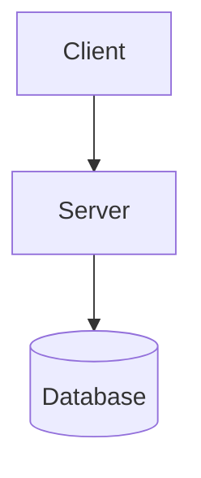

# Contributing to System Design Discussions

Welcome! This guide will help you contribute effectively to this repository.

---

## Ways to Contribute

### 1. Add a New Design Problem
Create a complete design problem following our template structure.

### 2. Improve Existing Content
- Fix errors or outdated information
- Add missing details or explanations
- Improve diagrams and examples

### 3. Add Feedback & Analysis
Share your insights on existing designs:
- Alternative approaches
- Real-world observations
- Performance considerations

### 4. Participate in Discussions
- Join our regular deep-dive sessions
- Share your interview experiences
- Help others with their questions

### 5. Add Resources
- Quality articles and papers
- Video tutorials
- Relevant code examples

---

## Adding a New Design Problem

### Step 1: Create the Directory Structure

```bash
mkdir -p design-problems/{problem-name}/{pre-reads,resources,diagrams,code-snippets,notes,discussions,feedback}
```

### Step 2: Use the Template

Copy from `templates/design-problem-template/` and customize:

```
design-problems/{problem-name}/
├── README.md              # Problem overview (required)
├── pre-reads/
│   └── prerequisites.md   # What to know before
├── resources/
│   └── links.md          # External resources
├── diagrams/
│   └── architecture.md   # Mermaid/PlantUML diagrams
├── code-snippets/
│   └── examples.md       # Implementation snippets
├── notes/
│   └── key-learnings.md  # Important takeaways
├── discussions/
│   └── trade-offs.md     # Approach comparisons
└── feedback/
    └── improvements.md   # Community suggestions
```

### Step 3: Complete Each Section

#### README.md (Required)
- Clear problem statement
- Functional requirements
- Non-functional requirements
- Constraints and assumptions
- High-level solution overview

#### Pre-reads
- Prerequisite concepts
- Related fundamentals
- Suggested reading order

#### Diagrams
- Use Mermaid for GitHub rendering
- Include high-level and detailed views
- Show data flow clearly

#### Discussions
- Compare at least 2 approaches
- Explain trade-offs
- Reference CAP theorem where applicable

---

## Code Style Guidelines

### Markdown
- Use proper headings hierarchy
- Include table of contents for long documents
- Use code fences with language tags

### Diagrams (Mermaid)
```markdown

```

### Code Snippets
- Include language identifier
- Add comments for clarity
- Keep examples focused and minimal

---

## Commit Message Format

```
type(scope): description

[optional body]

[optional footer]
```

**Types:**
- `feat`: New design problem or major addition
- `fix`: Corrections or bug fixes
- `docs`: Documentation improvements
- `refactor`: Restructuring without changing content
- `style`: Formatting changes

**Examples:**
```
feat(url-shortener): add complete design problem
docs(cap-theorem): improve explanation with examples
fix(twitter-design): correct sharding calculation
```

---

## Pull Request Process

1. **Fork** the repository
2. **Create** a feature branch
3. **Make** your changes
4. **Test** markdown rendering locally
5. **Submit** PR with clear description

### PR Description Template

```markdown
## What does this PR add/change?
Brief description of changes

## Type of change
- [ ] New design problem
- [ ] Improvement to existing content
- [ ] Bug fix / correction
- [ ] Documentation update

## Checklist
- [ ] Follows repository structure
- [ ] Diagrams render correctly
- [ ] No broken links
- [ ] Spelling/grammar checked
```

---

## Quality Standards

### Content Must:
- Be technically accurate
- Explain trade-offs, not just solutions
- Include practical examples
- Reference reliable sources
- Be beginner-friendly where possible

### Avoid:
- Copying content without attribution
- Overly complex explanations
- Outdated technologies without context
- Single "best" solution claims

---

## Feedback File Format

When adding to `feedback/` sections:

```markdown
## Feedback Entry

**Contributor:** @username
**Date:** YYYY-MM-DD

### Observation
What did you notice about this design?

### Suggested Improvement
How could this be better?

### Rationale
Why would this improvement help?

### Trade-offs
What are the downsides of this change?

---
```

---

## Recognition

Contributors are recognized in:
- `contributors/` directory profiles
- PR acknowledgments
- Discussion session credits

---

## Questions?

- Open an issue for questions
- Join our discussion sessions
- Reach out to maintainers

---

Thank you for contributing to the community!
