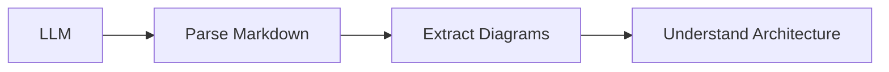

# LLM Integration Guide

This repository is designed to be **AI-friendly** for use with Claude, ChatGPT, GitHub Copilot, and other LLMs.

---

## Supported AI Tools

| Tool | Use Case | How to Use |
|------|----------|------------|
| **Claude** | Deep analysis, code generation, explanations | Use CLAUDE.md prompts |
| **ChatGPT** | Q&A, summaries, explanations | Copy markdown content |
| **GitHub Copilot** | Code completion, inline suggestions | Works in IDE |
| **Cursor** | AI-assisted coding | Full repo context |
| **Codeium** | Code suggestions | Works with codebase |

---

## Quick Start Prompts

### For Understanding a Design
```
I'm studying the [URL Shortener/Rate Limiter] system design from this repository.

Please:
1. Summarize the key architectural decisions
2. Explain the main trade-offs
3. List the technologies used and why
4. Identify potential interview follow-up questions
```

### For Creating a New Design
```
Using the template structure from this repository, help me create a system design for [YOUR SYSTEM].

Follow the 6-step framework:
1. Clarify requirements
2. Estimate capacity
3. Design API
4. Create high-level design
5. Deep dive into components
6. Address scaling and bottlenecks

Include Mermaid diagrams and code snippets.
```

### For Interview Preparation
```
Act as a system design interviewer. Using the [DESIGN NAME] from this repository:
1. Ask me clarifying questions
2. Guide me through the design process
3. Point out issues in my approach
4. Suggest improvements
5. Ask follow-up questions about scaling
```

### For Summarization
```
Summarize [FILE PATH] in the following format:

## TL;DR (1-2 sentences)

## Key Points (bullet list)

## Trade-offs

## When to Use

## When NOT to Use
```

---

## Repository Structure for LLMs

### File Naming Convention
```
README.md           → Main overview, start here
CLAUDE.md           → AI assistant prompts
INTERVIEW_APPROACH.md → Framework for interviews

design-problems/
└── {problem}/
    ├── README.md           → Full design document
    ├── diagrams/           → Mermaid/PlantUML diagrams
    ├── code-snippets/      → Implementation examples
    └── discussions/        → Trade-off analysis

fundamentals/
└── {concept}/
    └── README.md           → Concept explanation
```

### Metadata Headers
Each design document includes structured headers for easy parsing:

```markdown
# System Name - System Design

> **Difficulty:** Beginner | Intermediate | Advanced | Expert
> **Time:** 45-60 minutes
> **Companies:** Company1, Company2, Company3

## Problem Statement
[One paragraph description]

## Step 1: Clarify Requirements
[Structured requirements table]

...
```

---

## Diagram Integration

### Mermaid (Native GitHub)
All diagrams use Mermaid for native GitHub rendering:



### How LLMs Should Parse Diagrams
```
When you see a Mermaid code block:
1. Identify diagram type (graph, sequence, class, etc.)
2. Extract node relationships
3. Understand data flow direction
4. Identify key components
```

### Excalidraw Integration
- `.excalidraw` files in `diagrams/` folders
- JSON format, LLM-parseable
- Export as PNG/SVG for viewing

### Miro Integration
- Links to Miro boards in resources
- Export as images stored in repo
- Collaborative whiteboard sessions

---

## Structured Data Formats

### Design Summary Schema
```json
{
  "name": "URL Shortener",
  "difficulty": "Beginner",
  "time_minutes": 45,
  "companies": ["Amazon", "Microsoft", "Google"],
  "requirements": {
    "functional": ["Shorten URL", "Redirect", "Custom aliases"],
    "non_functional": {
      "availability": "99.99%",
      "latency_p99_ms": 100,
      "consistency": "eventual"
    }
  },
  "key_components": ["Load Balancer", "API Servers", "Redis", "Database"],
  "algorithms": ["Base62 encoding", "Counter-based ID"],
  "trade_offs": [
    {"decision": "AP over CP", "reason": "Availability critical for redirects"}
  ]
}
```

### For Copilot/Code Generation
Code snippets include language tags and context comments:

```python
# Context: Rate limiter using sliding window counter
# Algorithm: Weighted count from previous + current window
# Redis keys: rate_limit:{client_id}:{window}

def check_rate_limit(client_id: str, limit: int = 100, window: int = 60) -> bool:
    """
    Check if client is within rate limit using sliding window counter.

    Args:
        client_id: Unique identifier for the client
        limit: Maximum requests allowed per window
        window: Time window in seconds

    Returns:
        True if request is allowed, False if rate limited
    """
    # Implementation...
```

---

## Context Windows & Chunking

### For Large Context Models (Claude, GPT-4)
Provide full design documents:
```
Read the entire URL Shortener design from design-problems/url-shortener/README.md
```

### For Smaller Context Models
Use structured sections:
```
Focus only on Step 4: High-Level Design from the URL Shortener design.
```

### Recommended Reading Order
1. `README.md` - Repository overview
2. `INTERVIEW_APPROACH.md` - Framework
3. `fundamentals/` - Core concepts
4. `design-problems/{specific}/README.md` - Design solution

---

## Contributing with AI Assistance

### Using Claude/ChatGPT to Contribute
```
I want to add a new system design for [SYSTEM] to this repository.

1. Generate the README.md following the template structure
2. Create Mermaid diagrams for the architecture
3. Write code snippets in Python and Go
4. Include trade-off discussions
5. Add feedback template entries
```

### Code Review with AI
```
Review this system design for [SYSTEM]:
[Paste design content]

Check for:
- Missing requirements
- Scalability issues
- Security concerns
- Trade-offs not discussed
- Unclear explanations
```

### Generating Summaries
```
Create a study guide summary for [DESIGN] that I can review in 5 minutes before an interview.

Include:
- Key numbers to remember
- Main components
- Critical trade-offs
- Common follow-up questions
```

---

## API-Style Access (For Tool Integration)

### Fetching Content via GitHub API
```bash
# Get raw markdown
curl https://raw.githubusercontent.com/anirudhpundhir/system-design-discussions/main/design-problems/url-shortener/README.md

# List design problems
curl https://api.github.com/repos/anirudhpundhir/system-design-discussions/contents/design-problems
```

### For MCP Server Integration
This repo can be used with Model Context Protocol:
```json
{
  "type": "github_repo",
  "repo": "anirudhpundhir/system-design-discussions",
  "include_patterns": ["**/*.md"],
  "exclude_patterns": [".git/**"]
}
```

---

## Prompt Templates Library

### Template 1: Explain Like I'm Junior
```
Explain the [COMPONENT] from [DESIGN] as if I'm a junior developer with 1 year of experience.
Use simple analogies and avoid jargon where possible.
```

### Template 2: Interview Deep Dive
```
I'm preparing for a [COMPANY] interview. For the [DESIGN] system:
1. What are the most likely follow-up questions?
2. What would a senior engineer focus on?
3. What mistakes do candidates commonly make?
```

### Template 3: Compare Approaches
```
Compare the approaches discussed in [DESIGN]:
- Approach A: [name]
- Approach B: [name]

Create a comparison table with: Performance, Complexity, Cost, Scalability
```

### Template 4: Generate Test Questions
```
Based on [DESIGN], generate 10 quiz questions to test understanding:
- 3 easy (basic concepts)
- 4 medium (trade-offs)
- 3 hard (edge cases, scaling)
```

### Template 5: Create Flashcards
```
Create Anki-style flashcards from [DESIGN]:
Format:
Q: [Question]
A: [Answer]

Cover: Components, algorithms, trade-offs, numbers to remember
```

---

## Best Practices for AI Usage

### DO
- Provide full context when asking questions
- Reference specific files and sections
- Ask for explanations of trade-offs
- Request code in specific languages
- Ask for interview-style follow-ups

### DON'T
- Ask for memorization of exact numbers
- Expect AI to know real-time system metrics
- Assume AI recommendations are production-ready
- Skip understanding and just copy solutions

---

## Validation Checklist

When AI generates content for this repo, verify:

- [ ] Follows template structure
- [ ] Includes Mermaid diagrams (valid syntax)
- [ ] Has capacity estimations
- [ ] Discusses trade-offs
- [ ] Includes code snippets
- [ ] Mentions CAP theorem implications
- [ ] Lists follow-up questions

---

*This repository is optimized for AI-assisted learning. Feedback welcome!*
