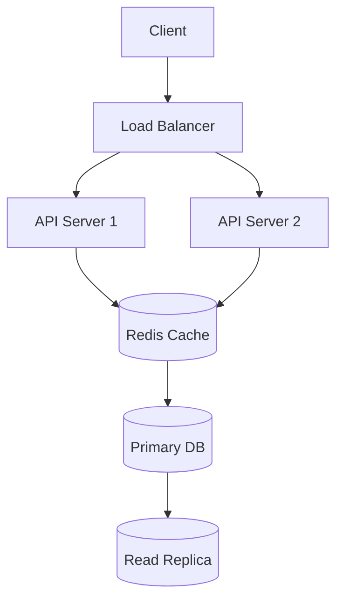

# System Design Discussions

> **Your One-Stop Shop for System Design Mastery**

A comprehensive, collaborative repository for learning system design - built for interview preparation, career growth, and continuous learning.

---

## Why This Repository?

- **Structured Learning Path** - From fundamentals to advanced designs
- **Real Interview Focus** - Problems asked at FAANG and top tech companies
- **Trade-off Driven** - No "best" solution, only trade-offs based on requirements
- **AI-Powered** - Claude integration for instant doubt resolution
- **Community Driven** - Weekly discussions, feedback, and collaborative improvements
- **Always Accessible** - One prompt away from answers

---

## Quick Start

### For Interview Candidates
```
1. Read fundamentals/          → Build strong foundations
2. Study INTERVIEW_APPROACH.md → Learn the framework
3. Practice design-problems/   → Apply knowledge
4. Review weekly-discussions/  → Get expert insights
```

### For Contributors
```
1. Check templates/            → Understand structure
2. Pick an issue or problem    → Start contributing
3. Add to feedback/            → Share your insights
4. Join Sunday discussions     → Learn together
```

---

## Repository Structure

```
📁 system-design-discussions/
│
├── 📄 CLAUDE.md                    # AI assistant guide
├── 📄 INTERVIEW_APPROACH.md        # The Interview Framework
├── 📄 CONTRIBUTING.md              # Contribution guidelines
│
├── 📁 fundamentals/                # Core Concepts
│   ├── 📁 cap-theorem/            # CAP, PACELC, consistency models
│   ├── 📁 design-principles/      # SOLID, DRY, scaling principles
│   ├── 📁 scalability-patterns/   # Load balancing, caching, sharding
│   └── 📁 data-patterns/          # Storage, replication, partitioning
│
├── 📁 technologies/                # Technology Knowledge Base
│   ├── 📁 ai-ml/                  # AI/ML infrastructure
│   ├── 📁 blockchain/             # Distributed ledger tech
│   ├── 📁 distributed-systems/    # Core distributed concepts
│   ├── 📁 cloud-infrastructure/   # AWS, GCP, Azure, K8s
│   ├── 📁 databases/              # SQL, NoSQL, NewSQL
│   ├── 📁 messaging-systems/      # Kafka, RabbitMQ, queues
│   ├── 📁 frameworks-languages/   # Tech stacks & languages
│   ├── 📁 low-latency/            # High-performance design
│   ├── 📁 consistency-models/     # Strong, eventual consistency
│   ├── 📁 legacy-systems/         # Modernization patterns
│   └── 📁 emerging-tech/          # Latest trends
│
├── 📁 design-problems/             # System Design Problems
│   └── 📁 {problem-name}/
│       ├── 📄 README.md           # Problem overview
│       ├── 📁 pre-reads/          # Prerequisites
│       ├── 📁 resources/          # Links, papers, videos
│       ├── 📁 diagrams/           # Architecture diagrams
│       ├── 📁 code-snippets/      # Implementation examples
│       ├── 📁 notes/              # Key learnings
│       ├── 📁 discussions/        # Trade-off analysis
│       └── 📁 feedback/           # Community improvements
│
├── 📁 templates/                   # Reusable Templates
├── 📁 resources/                   # Global Resources & Tools
│   ├── 📄 learning-path.md        # Structured learning guide
│   ├── 📄 diagram-tools.md        # Mermaid, PlantUML, Miro integration
│   ├── 📄 best-practices.md       # System design best practices
│   ├── 📄 design-evaluation-rubric.md # Scoring metrics
│   └── 📄 refactoring-guide.md    # Resolving design issues
├── 📁 weekly-discussions/          # Deep-Dive Notes
└── 📁 contributors/                # Community Profiles
```

---

## The Core Philosophy

### There Is No Single Best Design

Every system design decision involves trade-offs:

| Decision | Trade-off |
|----------|-----------|
| SQL vs NoSQL | Consistency vs Flexibility |
| Monolith vs Microservices | Simplicity vs Scalability |
| Sync vs Async | Latency vs Reliability |
| Cache More vs Less | Speed vs Freshness |
| Replicate vs Shard | Read Scale vs Write Scale |

**Your job is to understand requirements and make informed trade-offs.**

---

## Interview Approach Framework

### The 6-Step Method (45 minutes)

```
┌─────────────────────────────────────────────────────────────────┐
│  STEP 1: CLARIFY (2-3 min)                                      │
│  • Functional requirements                                       │
│  • Non-functional requirements                                   │
│  • Constraints and assumptions                                   │
├─────────────────────────────────────────────────────────────────┤
│  STEP 2: ESTIMATE (2-3 min)                                     │
│  • Users, DAU, requests/second                                  │
│  • Storage, bandwidth needs                                      │
│  • Read/Write ratio                                              │
├─────────────────────────────────────────────────────────────────┤
│  STEP 3: API DESIGN (3-5 min)                                   │
│  • Core endpoints                                                │
│  • Request/Response format                                       │
│  • Authentication approach                                       │
├─────────────────────────────────────────────────────────────────┤
│  STEP 4: HIGH-LEVEL DESIGN (10-15 min)                          │
│  • Major components                                              │
│  • Data flow                                                     │
│  • Storage decisions                                             │
├─────────────────────────────────────────────────────────────────┤
│  STEP 5: DEEP DIVE (10-15 min)                                  │
│  • Critical components                                           │
│  • Algorithms/data structures                                    │
│  • Handle edge cases                                             │
├─────────────────────────────────────────────────────────────────┤
│  STEP 6: BOTTLENECKS & SCALE (5-10 min)                         │
│  • Identify bottlenecks                                          │
│  • Propose solutions                                             │
│  • Discuss monitoring                                            │
└─────────────────────────────────────────────────────────────────┘
```

---

## Free Diagram Tools (API/Prompt Based)

| Tool | Type | Integration | Best For |
|------|------|-------------|----------|
| **Mermaid** | Text-to-diagram | Native GitHub | Quick diagrams in markdown |
| **Excalidraw** | Whiteboard | JSON files | Hand-drawn style diagrams |
| **tldraw** | Open-source whiteboard | Self-hosted/JSON | Collaborative sessions |
| **PlantUML** | Text-to-UML | GitHub Actions | Sequence diagrams |
| **D2** | Text-to-diagram | CLI/Library | Software architecture |
| **Eraser.io** | AI-powered | API available | AI-generated diagrams |

### Mermaid Example (Works in GitHub!)



---

## Design Problems (Roadmap)

### Beginner
- [ ] URL Shortener
- [ ] Pastebin
- [ ] Rate Limiter
- [ ] Key-Value Store

### Intermediate
- [ ] Twitter/X Timeline
- [ ] Instagram Feed
- [ ] WhatsApp Messaging
- [ ] Notification System

### Advanced
- [ ] YouTube/Netflix Streaming
- [ ] Google Search
- [ ] Uber/Lyft
- [ ] Distributed Cache

### Expert
- [ ] Google Docs Collaboration
- [ ] Stock Exchange
- [ ] Distributed Database
- [ ] Ad Serving System

---

## Regular Discussion Sessions

We conduct periodic deep-dive sessions covering:

| Session Type | Focus |
|--------------|-------|
| Fundamentals Review | CAP, Scaling, Caching |
| Design Problem Walkthrough | Complete end-to-end design |
| Deep Tech Dive | Database internals, consensus, distributed systems |
| Mock Interviews | Practice sessions with feedback |

**Notes are captured in `weekly-discussions/`**

---

## Using Claude AI

This repository is optimized for AI-assisted learning. See `CLAUDE.md` for:

- Understanding designs quickly
- Comparing approaches
- Generating diagrams
- Interview simulation
- Doubt resolution

**Example Prompts:**
```
"Explain the trade-offs between SQL and NoSQL for a social media app"
"Create a Mermaid diagram for Twitter's tweet ingestion pipeline"
"Simulate a 45-minute system design interview for designing Netflix"
"What would break first if we 10x the load on this design?"
```

---

## GitHub Repository Permanence

**Yes, GitHub will keep this repository forever** as long as:
- The account remains active
- Repository doesn't violate Terms of Service
- Content is legal and appropriate

For extra safety:
- Enable GitHub Archive Program (Settings → Features)
- Use GitHub Releases for versioned snapshots
- Consider mirroring to GitLab/Bitbucket

---

## Contributing

We welcome contributions! See `CONTRIBUTING.md` for:
- Adding new design problems
- Improving existing content
- Participating in discussions
- Providing feedback

---

## License

MIT License - Use freely for learning and preparation.

---

## Star This Repo

If this helps your interview preparation, give it a ⭐ to help others find it!

---

*Built with passion for the engineering community*
