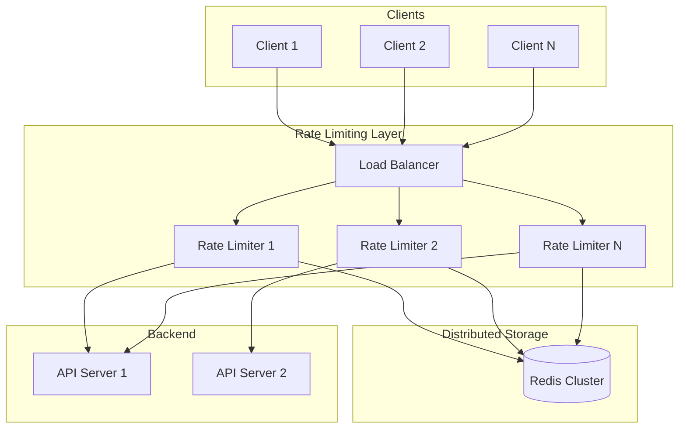
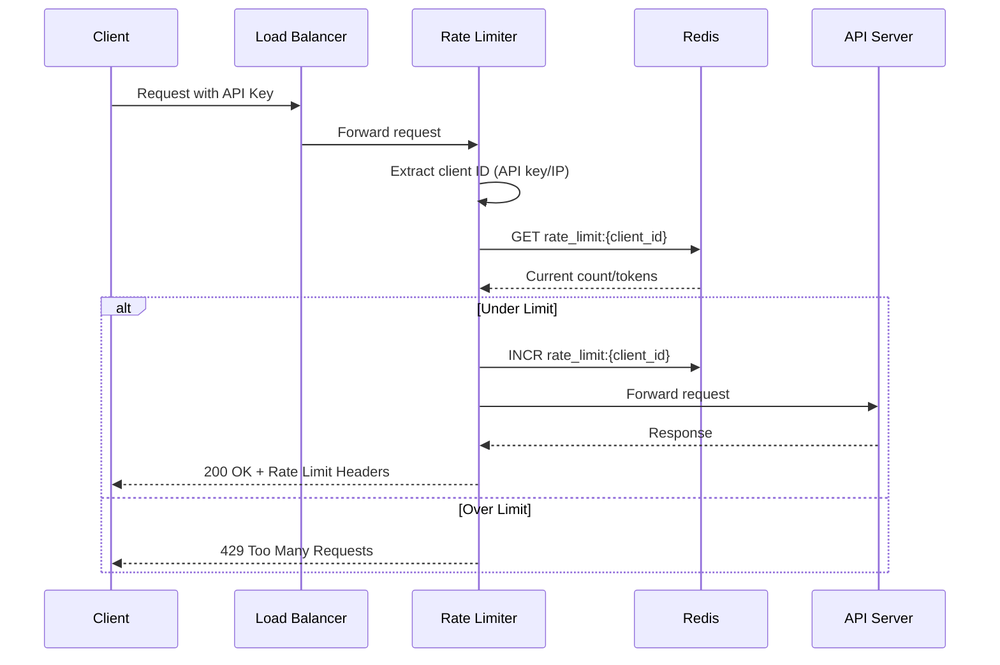

# Rate Limiter - System Design

> **Difficulty:** Beginner-Intermediate
> **Time:** 45-60 minutes
> **Companies:** Stripe, Cloudflare, AWS, Google, Meta, Uber, Netflix

---

## Problem Statement

Design a rate limiting system that controls the rate of requests a client can send to an API. The system should:
- Limit requests per client/IP/API key
- Be distributed and work across multiple servers
- Have minimal latency overhead
- Support different rate limiting strategies

**Real-world examples:** AWS API Gateway, Cloudflare, Stripe API, GitHub API

---

## Why Rate Limiting?

```
Without Rate Limiting:
┌─────────┐     1M req/sec     ┌─────────┐
│  Bots   │───────────────────►│  API    │ ← Server crashes
│ Attacks │                    │ Server  │
└─────────┘                    └─────────┘

With Rate Limiting:
┌─────────┐     1M req/sec     ┌─────────┐     100 req/sec     ┌─────────┐
│  Bots   │───────────────────►│  Rate   │───────────────────►│  API    │
│ Attacks │                    │ Limiter │                     │ Server  │
└─────────┘                    └─────────┘                     └─────────┘
                                    │
                                    ▼
                              429 Too Many
                                Requests
```

**Use Cases:**
- Prevent DDoS attacks
- Prevent resource starvation
- Manage API quotas (free vs paid tiers)
- Control costs for pay-per-use services
- Ensure fair usage among clients

---

## Step 1: Clarify Requirements

### Functional Requirements

| Requirement | Priority | Notes |
|-------------|----------|-------|
| Limit requests by client/IP | Must Have | Identify clients uniquely |
| Support multiple rate limits | Must Have | Different limits per API/user tier |
| Return proper response | Must Have | 429 with retry-after header |
| Distributed support | Must Have | Work across multiple servers |
| Different algorithms | Nice to Have | Token bucket, sliding window, etc. |

### Non-Functional Requirements

| Requirement | Target | Notes |
|-------------|--------|-------|
| Latency overhead | < 1ms | Must not slow down requests |
| Availability | 99.99% | If limiter fails, should fail open |
| Accuracy | ~99% | Small inaccuracy acceptable |
| Scalability | 1M+ TPS | Handle massive request volume |

### Design Considerations

```
Where to implement rate limiting?

Option 1: Client-side
├── Pros: Reduces server load
├── Cons: Can be bypassed, not secure
└── Use: Nice-to-have, not primary

Option 2: Middleware/API Gateway
├── Pros: Centralized, before business logic
├── Cons: Single point of potential failure
└── Use: Most common approach ✓

Option 3: Application level
├── Pros: Fine-grained control
├── Cons: Reaches application code
└── Use: When business logic needed

Option 4: Load Balancer
├── Pros: Very early in pipeline
├── Cons: Limited flexibility
└── Use: Basic DDoS protection
```

---

## Step 2: Capacity Estimation

### Traffic Estimates

| Metric | Value |
|--------|-------|
| Total API requests | 10M per day |
| Requests per second | ~120 TPS (avg), 500 TPS (peak) |
| Unique clients | 1M per day |
| Rate limit checks | Same as API requests |

### Storage Estimates

```
Per-client state:
- client_id: 16 bytes
- request_count: 8 bytes
- window_start: 8 bytes
- metadata: 32 bytes
Total: ~64 bytes per client

Storage for 1M active clients:
64 bytes × 1M = 64 MB

Conclusion: Fits entirely in memory (Redis)
```

### Latency Budget

```
Total API latency: 100ms
Rate limiting overhead: < 1ms (1%)

Breakdown:
- Hash client ID: 0.01ms
- Redis lookup: 0.1-0.5ms
- Update counter: 0.1-0.5ms
- Total: < 1ms ✓
```

---

## Step 3: Rate Limiting Algorithms

### Algorithm 1: Token Bucket

```
┌─────────────────────────────────────────────────────────────┐
│                     TOKEN BUCKET                             │
│                                                              │
│   Bucket Capacity: 10 tokens                                 │
│   Refill Rate: 2 tokens/second                              │
│                                                              │
│   ┌─────────────────────────────┐                           │
│   │ 🪙 🪙 🪙 🪙 🪙 🪙 🪙        │  7 tokens available       │
│   │                             │                            │
│   │         BUCKET              │                            │
│   └─────────────────────────────┘                           │
│            ▲                                                 │
│            │ +2 tokens/sec                                   │
│                                                              │
│   Request arrives:                                           │
│   ├── Tokens > 0? → Allow, remove 1 token                   │
│   └── Tokens = 0? → Reject (429)                            │
│                                                              │
│   Pros: Allows bursts up to bucket size                     │
│   Cons: Memory for bucket per client                        │
└─────────────────────────────────────────────────────────────┘
```

**Implementation:**
```python
class TokenBucket:
    def __init__(self, capacity, refill_rate):
        self.capacity = capacity          # Max tokens
        self.refill_rate = refill_rate    # Tokens per second
        self.tokens = capacity
        self.last_refill = time.time()

    def allow_request(self):
        self._refill()
        if self.tokens >= 1:
            self.tokens -= 1
            return True
        return False

    def _refill(self):
        now = time.time()
        elapsed = now - self.last_refill
        tokens_to_add = elapsed * self.refill_rate
        self.tokens = min(self.capacity, self.tokens + tokens_to_add)
        self.last_refill = now
```

---

### Algorithm 2: Leaky Bucket

```
┌─────────────────────────────────────────────────────────────┐
│                      LEAKY BUCKET                            │
│                                                              │
│   Requests enter at variable rate                           │
│            │ │ │ │ │                                        │
│            ▼ ▼ ▼ ▼ ▼                                        │
│   ┌─────────────────────────────┐                           │
│   │ ● ● ● ● ●                   │  Queue (FIFO)             │
│   │           ● ● ●             │                            │
│   └───────────────┬─────────────┘                           │
│                   │                                          │
│                   ▼ Fixed rate out (e.g., 10/sec)           │
│              ┌─────────┐                                    │
│              │ Process │                                    │
│              └─────────┘                                    │
│                                                              │
│   Overflow: Reject (429)                                    │
│                                                              │
│   Pros: Smooth output rate, good for steady processing     │
│   Cons: Bursts wait in queue, old requests may timeout     │
└─────────────────────────────────────────────────────────────┘
```

---

### Algorithm 3: Fixed Window Counter

```
┌─────────────────────────────────────────────────────────────┐
│                  FIXED WINDOW COUNTER                        │
│                                                              │
│   Window: 1 minute, Limit: 100 requests                     │
│                                                              │
│   Time:  |-------- 1:00-1:59 --------|-------- 2:00-2:59 ---|
│   Count:           87                           12           │
│                                                              │
│   ✓ Allow if count < limit                                  │
│   ✗ Reject if count >= limit                                │
│                                                              │
│   PROBLEM: Burst at window edge                             │
│                                                              │
│   |.....[50 req]|[50 req].....| = 100 requests in 1 sec!   │
│        1:59      2:00                                        │
│                                                              │
│   Pros: Simple, memory efficient                            │
│   Cons: Allows 2x burst at window boundaries                │
└─────────────────────────────────────────────────────────────┘
```

---

### Algorithm 4: Sliding Window Log

```
┌─────────────────────────────────────────────────────────────┐
│                   SLIDING WINDOW LOG                         │
│                                                              │
│   Store timestamp of each request                           │
│                                                              │
│   Requests: [1:00:01, 1:00:15, 1:00:30, 1:00:45, 1:01:05]   │
│                                                              │
│   Current time: 1:01:30                                     │
│   Window: 1 minute                                          │
│                                                              │
│   Count requests where timestamp > (1:01:30 - 60s)         │
│   Count = 2 (1:00:45, 1:01:05 are in window)               │
│                                                              │
│   Pros: Most accurate                                       │
│   Cons: High memory (store every timestamp)                 │
└─────────────────────────────────────────────────────────────┘
```

---

### Algorithm 5: Sliding Window Counter (Recommended)

```
┌─────────────────────────────────────────────────────────────┐
│                SLIDING WINDOW COUNTER                        │
│                                                              │
│   Combines Fixed Window efficiency with Sliding accuracy    │
│                                                              │
│   Previous window: 84 requests                              │
│   Current window:  36 requests                              │
│   Current position: 25% into window                         │
│                                                              │
│   Weighted count = (84 × 0.75) + (36 × 0.25)               │
│                  = 63 + 9 = 72 requests                     │
│                                                              │
│   |=======prev window=======|===current window===|          │
│   |         84 req          |  36 req  |                    │
│                              └──25%──┘                       │
│                                                              │
│   Pros: Low memory, good accuracy, no boundary burst        │
│   Cons: Approximation (but very close)                      │
└─────────────────────────────────────────────────────────────┘
```

**Implementation:**
```python
def sliding_window_count(client_id, window_size=60, limit=100):
    now = time.time()
    current_window = int(now // window_size)
    previous_window = current_window - 1

    # Get counts from Redis
    current_count = redis.get(f"{client_id}:{current_window}") or 0
    previous_count = redis.get(f"{client_id}:{previous_window}") or 0

    # Calculate position in current window (0 to 1)
    window_position = (now % window_size) / window_size

    # Weighted count
    weighted_count = (previous_count * (1 - window_position)) + current_count

    if weighted_count < limit:
        redis.incr(f"{client_id}:{current_window}")
        redis.expire(f"{client_id}:{current_window}", window_size * 2)
        return True  # Allow
    return False  # Reject
```

---

### Algorithm Comparison

| Algorithm | Memory | Accuracy | Burst Handling | Complexity |
|-----------|--------|----------|----------------|------------|
| Token Bucket | Medium | High | Allows controlled bursts | Medium |
| Leaky Bucket | Medium | High | Smooths bursts | Medium |
| Fixed Window | Low | Medium | 2x burst at edges | Low |
| Sliding Log | High | Highest | No bursts | Medium |
| Sliding Counter | Low | High | Minimal burst | Low |

**Recommendation:**
- **Token Bucket** for APIs needing burst tolerance
- **Sliding Window Counter** for general rate limiting

---

## Step 4: High-Level Design

### Architecture



### Components

| Component | Responsibility | Technology |
|-----------|----------------|------------|
| Rate Limiter | Check and enforce limits | Custom middleware |
| Redis Cluster | Store counters/tokens | Redis 7+ |
| Rules Engine | Define rate limit rules | Config/DB |
| Analytics | Track usage patterns | Kafka + ClickHouse |

---

## Step 5: Detailed Design

### Request Flow



### Redis Data Structure

```
# Token Bucket (per client)
HSET rate_limit:client123 tokens 10 last_refill 1771027200

# Sliding Window Counter (per client per window)
SET rate_limit:client123:17040672 45
EXPIRE rate_limit:client123:17040672 120

# Rate Limit Rules
HSET rules:api_v1 default_limit 100 window 60
HSET rules:api_v1:premium limit 1000 window 60
```

### Rate Limit Rules

```yaml
# rules.yaml
rate_limits:
  - name: default
    requests: 100
    window: 60  # seconds

  - name: premium
    requests: 1000
    window: 60

  - name: enterprise
    requests: 10000
    window: 60

endpoints:
  - path: /api/v1/*
    default_rule: default
    overrides:
      premium_users: premium
      enterprise_users: enterprise

  - path: /api/v1/search
    default_rule: search_limit
    requests: 10
    window: 60
```

### Response Headers

```http
HTTP/1.1 200 OK
X-RateLimit-Limit: 100
X-RateLimit-Remaining: 45
X-RateLimit-Reset: 1771027260

# When rate limited:
HTTP/1.1 429 Too Many Requests
X-RateLimit-Limit: 100
X-RateLimit-Remaining: 0
X-RateLimit-Reset: 1771027260
Retry-After: 30
```

---

## Step 6: Distributed Rate Limiting

### The Challenge

```
Problem: Multiple rate limiter instances

┌─────────────┐        ┌─────────────┐
│ Rate Limiter│        │ Rate Limiter│
│   Server 1  │        │   Server 2  │
│  count: 50  │        │  count: 50  │
└─────────────┘        └─────────────┘

Each thinks client used 50 requests
Actually client used 100 requests!
```

### Solution 1: Centralized Store (Redis)

```
┌─────────────┐        ┌─────────────┐
│ Rate Limiter│        │ Rate Limiter│
│   Server 1  │        │   Server 2  │
└──────┬──────┘        └──────┬──────┘
       │                      │
       └──────────┬───────────┘
                  │
           ┌──────▼──────┐
           │   Redis     │  Single source of truth
           │  count: 100 │
           └─────────────┘
```

**Pros:** Accurate, simple
**Cons:** Redis is single point of failure, latency for remote calls

### Solution 2: Sticky Sessions

```
┌─────────────────────────────────────┐
│           Load Balancer             │
│   (Hash client_id to server)        │
└─────────────────────────────────────┘
        │              │
        ▼              ▼
┌─────────────┐  ┌─────────────┐
│ Rate Limiter│  │ Rate Limiter│
│  (clients   │  │  (clients   │
│   A, C, E)  │  │   B, D, F)  │
└─────────────┘  └─────────────┘
```

**Pros:** No coordination needed
**Cons:** Uneven load, server failure affects subset

### Solution 3: Eventual Consistency with Sync

```
Each server maintains local count
Periodically sync to central store
Accept small inaccuracy

┌─────────────┐        ┌─────────────┐
│   Local: 30 │        │   Local: 25 │
└──────┬──────┘        └──────┬──────┘
       │    Sync every 1s     │
       └──────────┬───────────┘
                  ▼
           ┌─────────────┐
           │   Redis     │
           │  Total: 55  │
           └─────────────┘
```

### Recommended: Lua Script for Atomicity

```lua
-- rate_limit.lua (runs atomically in Redis)
local key = KEYS[1]
local limit = tonumber(ARGV[1])
local window = tonumber(ARGV[2])

local current = redis.call('GET', key)
if current and tonumber(current) >= limit then
    return 0  -- Rejected
end

local count = redis.call('INCR', key)
if count == 1 then
    redis.call('EXPIRE', key, window)
end

return limit - count  -- Remaining
```

---

## Step 7: Handling Edge Cases

### Race Conditions

```
Without atomicity:
Thread 1: GET count → 99
Thread 2: GET count → 99
Thread 1: count < 100? → INCR → 100
Thread 2: count < 100? → INCR → 101  ← Over limit!

Solution: Use Redis INCR (atomic) or Lua scripts
```

### Clock Synchronization

```
Problem: Different servers have different clocks

Server 1 (1:00:00): Window = minute 60
Server 2 (1:00:03): Window = minute 60

Solution:
1. Use Redis server time (REDIS TIME command)
2. Use NTP for clock sync across servers
3. Use sliding window (less sensitive to clock drift)
```

### Fail Open vs Fail Closed

```
If Redis is unavailable:

Fail Open (Recommended for most cases):
├── Allow all requests
├── Log the failure
├── Alert operations team
└── Use: When availability > protection

Fail Closed:
├── Reject all requests
├── Return 503 Service Unavailable
└── Use: When protection is critical (payments)
```

---

## Step 8: Scaling & Performance

### Redis Cluster for High Throughput

```
┌─────────────────────────────────────────────────────────┐
│                    Redis Cluster                         │
│                                                          │
│  ┌─────────┐   ┌─────────┐   ┌─────────┐              │
│  │ Shard 1 │   │ Shard 2 │   │ Shard 3 │              │
│  │clients  │   │clients  │   │clients  │              │
│  │ A-H     │   │ I-P     │   │ Q-Z     │              │
│  └─────────┘   └─────────┘   └─────────┘              │
│                                                          │
│  Each shard handles subset of clients                   │
│  Hash slot determines shard: CRC16(key) % 16384        │
└─────────────────────────────────────────────────────────┘
```

### Local Cache + Remote Store

```
┌───────────────────────────────────────┐
│           Rate Limiter                │
│  ┌─────────────────────────────────┐  │
│  │     Local Cache (LRU)           │  │
│  │  Hot clients: 80% hit rate      │  │
│  └──────────────┬──────────────────┘  │
│                 │ Miss                 │
│                 ▼                      │
│  ┌─────────────────────────────────┐  │
│  │          Redis                   │  │
│  └─────────────────────────────────┘  │
└───────────────────────────────────────┘

Benefit: Reduce Redis calls by 80%
```

### Performance Optimizations

| Optimization | Impact |
|--------------|--------|
| Redis pipelining | 5x throughput |
| Connection pooling | Reduce connection overhead |
| Lua scripts | Atomic, single round trip |
| Local caching | 80% fewer Redis calls |
| Async logging | Don't block on analytics |

---

## CAP Theorem Analysis

**Our choice:** AP (Availability + Partition Tolerance)

**Justification:**
- Rate limiting should not block legitimate requests
- Small over-limit (allowing extra requests) is acceptable
- Fail open on Redis unavailability

**Trade-offs:**
- May allow slightly more requests during network issues
- Eventually consistent counters across regions

---

## Step 9: Monitoring & Alerting

### Key Metrics

| Metric | Description | Alert Threshold |
|--------|-------------|-----------------|
| Rate limit hits | Requests hitting limit | > 10% of total |
| Redis latency | Time for Redis operations | p99 > 5ms |
| Rejection rate | % of rejected requests | Sudden spike |
| Cache hit rate | Local cache effectiveness | < 70% |

### Dashboard

```
┌─────────────────────────────────────────────────────────┐
│              Rate Limiter Dashboard                      │
├─────────────────────────────────────────────────────────┤
│                                                          │
│  Requests/sec: 12,453    Rejections/sec: 234            │
│  Rejection Rate: 1.8%    Redis Latency: 0.3ms           │
│                                                          │
│  Top Rate Limited Clients:                               │
│  1. client_abc123 - 10,234 rejections                   │
│  2. client_xyz789 - 5,123 rejections                    │
│  3. 192.168.1.100 - 2,456 rejections                    │
│                                                          │
│  [Graph: Requests vs Rejections over time]              │
│                                                          │
└─────────────────────────────────────────────────────────┘
```

---

## Follow-up Questions

### 1. How to handle distributed rate limiting across regions?

```
Option A: Global Redis with cross-region replication
├── Single source of truth
├── Higher latency for remote regions
└── Use for strict global limits

Option B: Regional limits with quota allocation
├── Each region gets portion of global limit
├── Global: 1000/min → US: 500, EU: 300, Asia: 200
└── Use for latency-sensitive applications

Option C: Hierarchical limiting
├── Local limit (per server)
├── Regional limit (per region)
├── Global limit (across all)
└── Most flexible, most complex
```

### 2. How to rate limit by different dimensions?

```yaml
# Multi-dimensional rate limiting
dimensions:
  - by_ip:
      limit: 100/min
  - by_user:
      limit: 1000/min
  - by_api_key:
      limit: 10000/min
  - by_endpoint:
      /search: 10/min
      /upload: 5/min

# All dimensions must pass for request to be allowed
```

### 3. How to implement tiered pricing limits?

```
Free Tier:     100 requests/day
Basic Tier:    10,000 requests/day
Pro Tier:      100,000 requests/day
Enterprise:    Custom limits

Implementation:
1. Store tier in user profile
2. Lookup tier on each request
3. Apply corresponding limit
4. Track usage for billing
```

---

## References

- [Stripe Rate Limiting](https://stripe.com/blog/rate-limiters)
- [Cloudflare Rate Limiting](https://blog.cloudflare.com/counting-things-a-lot-of-different-things/)
- [Token Bucket Algorithm](https://en.wikipedia.org/wiki/Token_bucket)
- [Google Cloud Rate Limiting](https://cloud.google.com/architecture/rate-limiting-strategies-techniques)

---

*Last updated: 2026-02-15*
