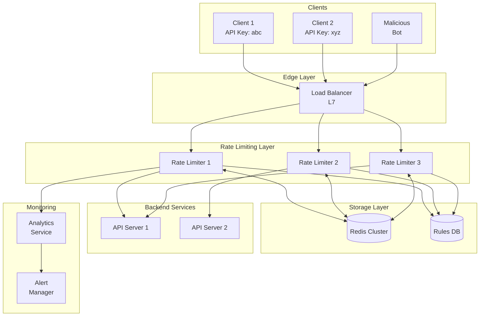
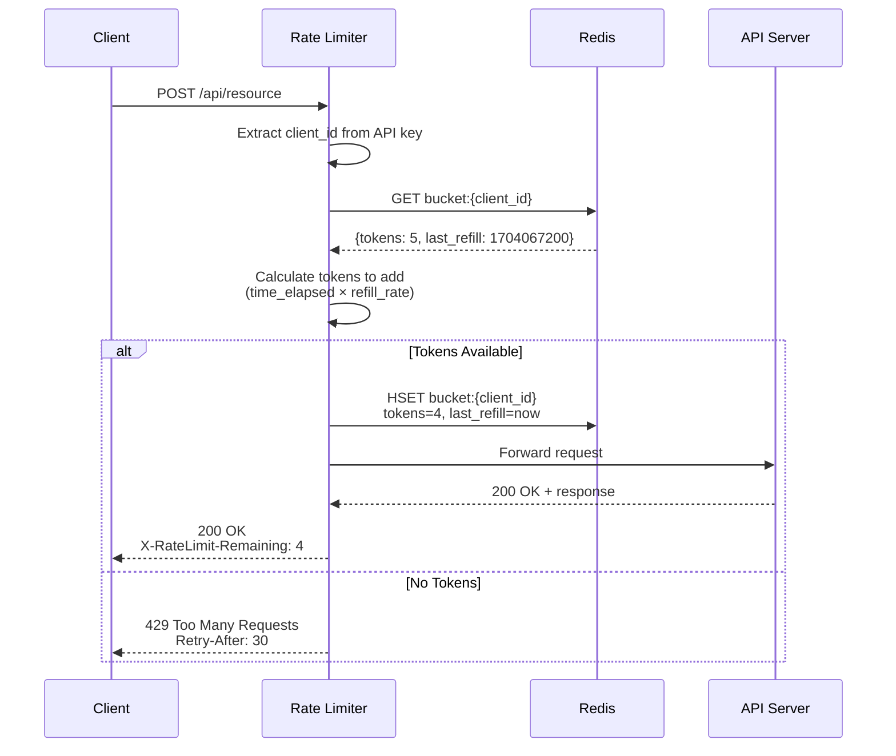
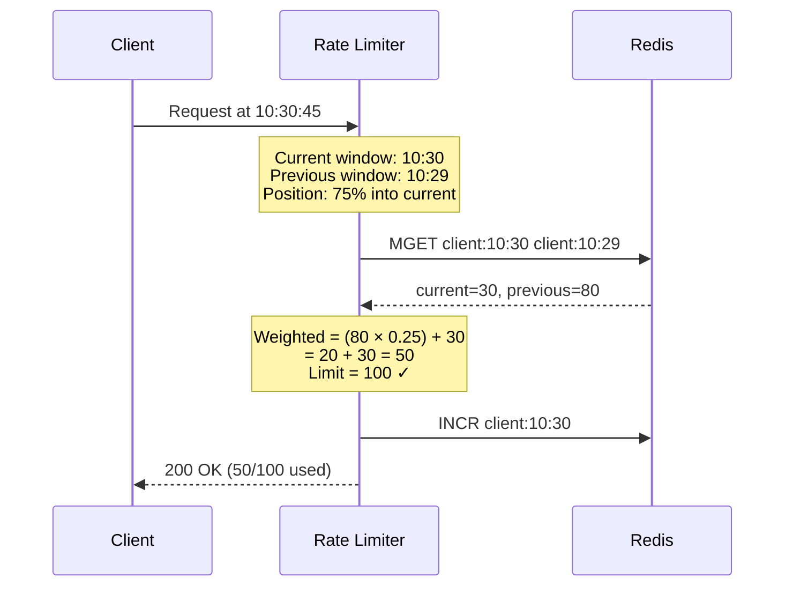
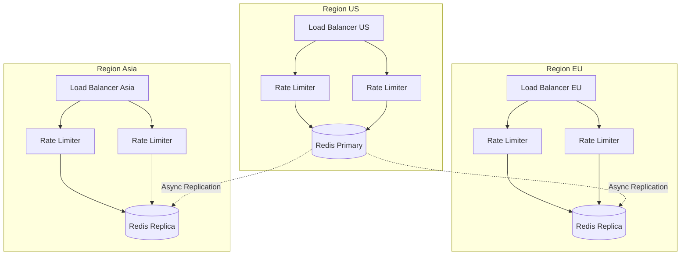
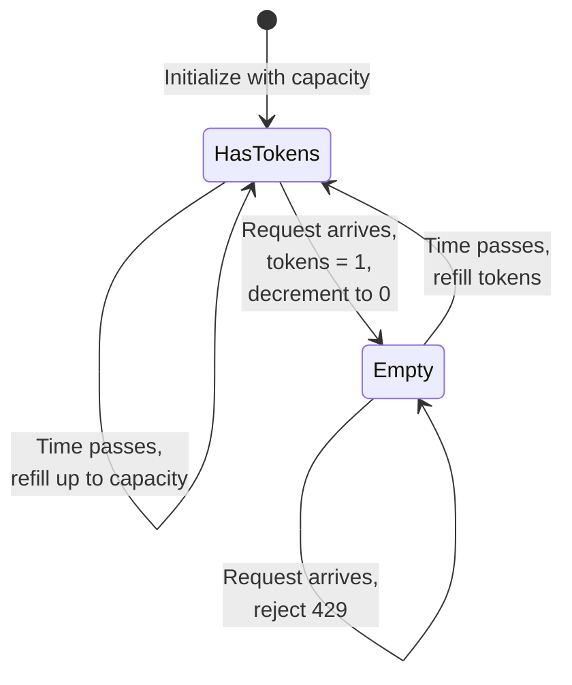
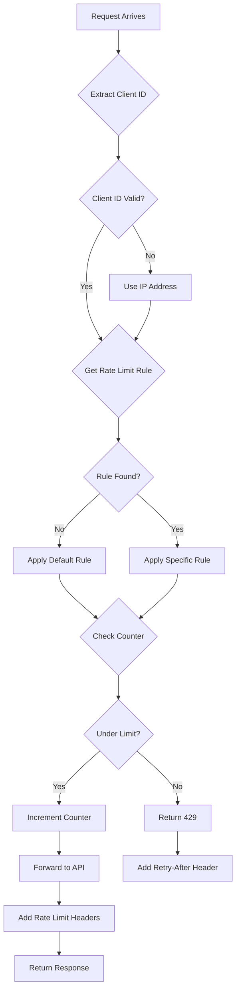
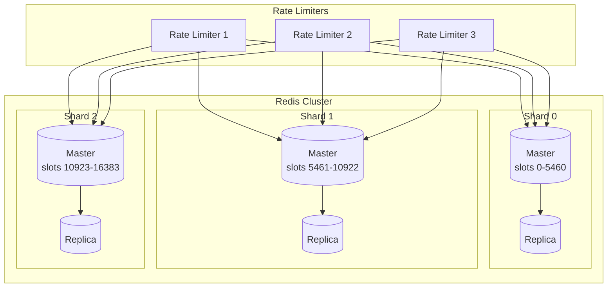
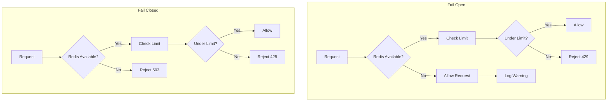
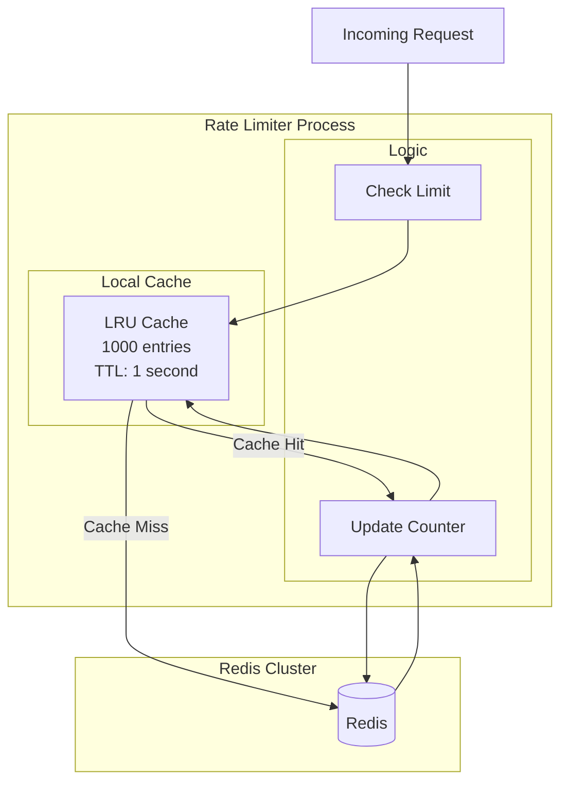

# Rate Limiter - Architecture Diagrams

## High-Level Architecture



## Request Flow - Token Bucket Algorithm



## Sliding Window Counter Flow



## Distributed Rate Limiting Architecture



## Token Bucket State Machine



## Rate Limit Decision Tree



## Redis Cluster Sharding



## Algorithm Comparison Visual

```
TOKEN BUCKET:
┌────────────────────────────────────────────────────────────────┐
│   Bucket (capacity=10)          │  Allows bursts up to 10     │
│   ████████░░                    │  Refills at steady rate     │
│   8 tokens available            │                              │
└────────────────────────────────────────────────────────────────┘

LEAKY BUCKET:
┌────────────────────────────────────────────────────────────────┐
│   ┌─────────────┐               │  Smooths out bursts         │
│   │ ● ● ● ● ●   │ ──► ● ● ●    │  Fixed output rate          │
│   │ Queue       │               │                              │
│   └─────────────┘               │                              │
└────────────────────────────────────────────────────────────────┘

FIXED WINDOW:
┌────────────────────────────────────────────────────────────────┐
│   |────Window 1────|────Window 2────|                         │
│   |     87/100     |     23/100     |  Resets each window    │
│                                      │  Edge case: 2x burst   │
└────────────────────────────────────────────────────────────────┘

SLIDING WINDOW:
┌────────────────────────────────────────────────────────────────┐
│   |=====Previous=====|===Current===|                          │
│   |       80         |     30      | Weighted calculation     │
│   |                  └────40%────┘ | Smooths edge cases       │
│   Weighted = 80×0.6 + 30 = 78                                 │
└────────────────────────────────────────────────────────────────┘
```

## Fail-Open vs Fail-Closed



## Local Cache + Redis Architecture


