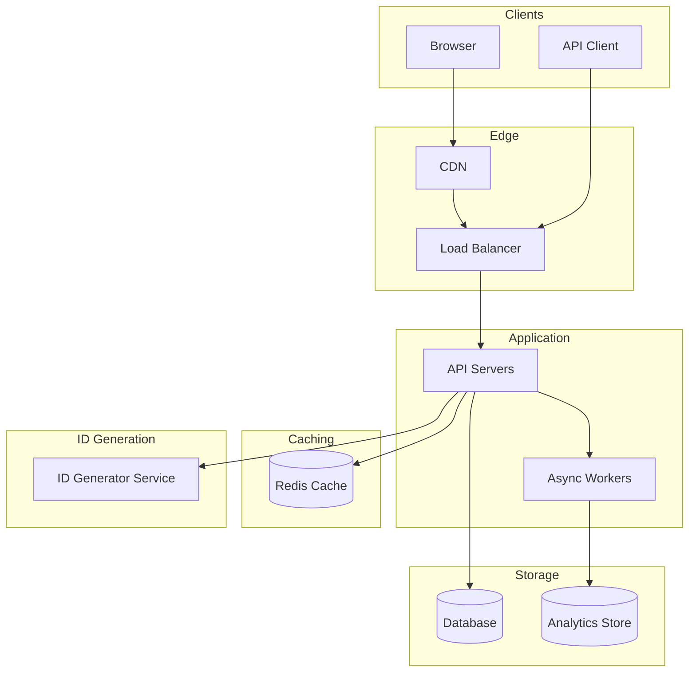
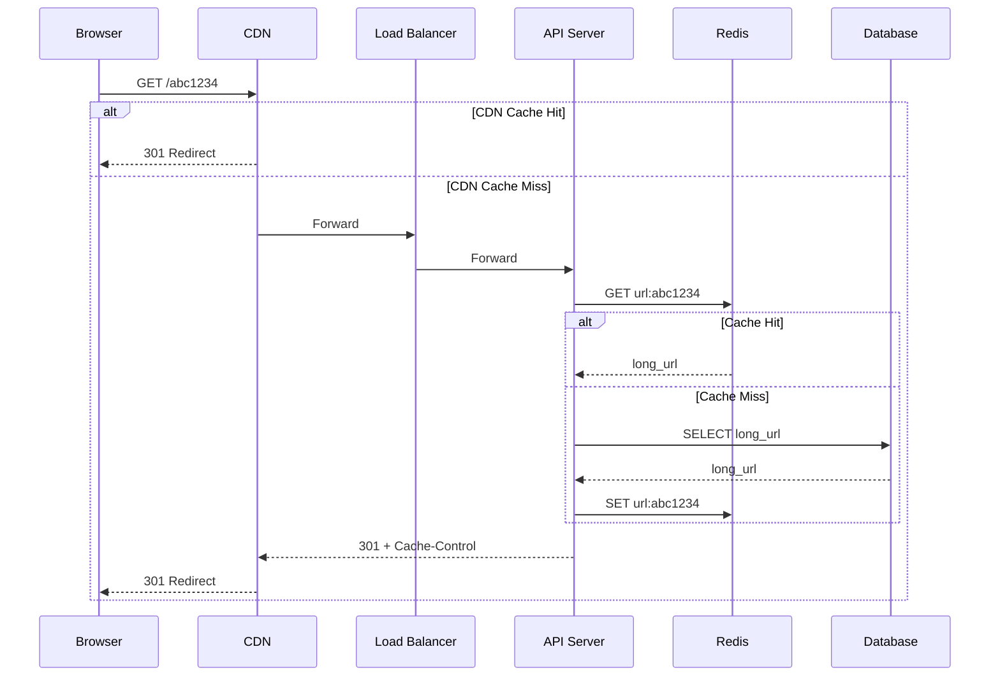

# URL Shortener - System Design

> **Difficulty:** Beginner
> **Time:** 45-60 minutes
> **Companies:** Amazon, Microsoft, Google, Meta, Uber, Twitter

---

## Problem Statement

Design a URL shortening service like TinyURL or bit.ly that:
- Converts long URLs to short, unique aliases
- Redirects users from short URLs to original URLs
- Tracks basic analytics (optional)

**Real-world examples:** bit.ly, TinyURL, t.co (Twitter), goo.gl (deprecated)

---

## Step 1: Clarify Requirements

### Functional Requirements

| Requirement | Priority | Notes |
|-------------|----------|-------|
| Shorten URL | Must Have | Generate unique short URL from long URL |
| Redirect | Must Have | Redirect short URL to original |
| Custom aliases | Nice to Have | Let users choose their alias |
| Expiration | Nice to Have | URLs expire after time/clicks |
| Analytics | Nice to Have | Track clicks, referrers, geography |

### Non-Functional Requirements

| Requirement | Target | Notes |
|-------------|--------|-------|
| Availability | 99.99% | Users expect redirects to always work |
| Latency | p99 < 100ms | Redirects must be fast |
| Consistency | Eventual OK | Same URL can map to same short URL eventually |
| Durability | No data loss | Once shortened, URL must persist |
| Scale | 100M URLs/month | Write heavy during creation |

### Out of Scope
- User authentication (for basic version)
- API rate limiting details
- Detailed analytics dashboard

### Assumptions
- Read-heavy system (100:1 read to write ratio)
- Short URLs should be as short as possible
- No explicit deletion (URLs expire or persist forever)

---

## Step 2: Capacity Estimation

### Traffic Estimates

| Metric | Calculation | Result |
|--------|-------------|--------|
| New URLs per month | Given | 100M |
| New URLs per day | 100M / 30 | 3.3M |
| New URLs per second | 3.3M / 86400 | ~40 TPS (write) |
| Redirects per second | 40 × 100 (read:write) | ~4,000 TPS (read) |
| Peak redirects | 4,000 × 3 | ~12,000 TPS |

### Storage Estimates

| Data | Size | Volume | Total |
|------|------|--------|-------|
| URL mapping | ~500 bytes | 100M/month | 50 GB/month |
| **5-year storage** | | | **3 TB** |

```
URL Record Size Breakdown:
- short_url: 7 chars = 7 bytes
- long_url: avg 200 chars = 200 bytes
- created_at: 8 bytes
- expires_at: 8 bytes
- user_id: 16 bytes (UUID, optional)
- metadata: ~260 bytes
Total: ~500 bytes
```

### Bandwidth Estimates

| Direction | Calculation | Result |
|-----------|-------------|--------|
| Incoming (write) | 40 TPS × 500 bytes | 20 KB/s |
| Outgoing (redirect) | 4,000 TPS × 500 bytes | 2 MB/s |

### Summary
```
Read:Write Ratio = 100:1 (READ HEAVY)
Peak Read QPS = 12,000
Storage (5 years) = 3 TB
Short URL length needed: 7 characters (62^7 = 3.5 trillion combinations)
```

---

## Step 3: API Design

### Core APIs

#### Create Short URL
```http
POST /api/v1/urls

Request:
{
    "long_url": "https://example.com/very/long/path?with=params",
    "custom_alias": "my-link",     // optional
    "expires_at": "2027-12-31"     // optional
}

Response: 201 Created
{
    "short_url": "https://short.ly/abc1234",
    "long_url": "https://example.com/very/long/path?with=params",
    "created_at": "2026-01-15T10:30:00Z",
    "expires_at": "2027-12-31T00:00:00Z"
}
```

#### Redirect (Browser Request)
```http
GET /{short_code}

Response: 301 Moved Permanently
Location: https://example.com/very/long/path?with=params
```

#### Get URL Info
```http
GET /api/v1/urls/{short_code}

Response: 200 OK
{
    "short_url": "https://short.ly/abc1234",
    "long_url": "https://example.com/very/long/path?with=params",
    "created_at": "2026-01-15T10:30:00Z",
    "clicks": 1523
}
```

### API Considerations
- Rate limiting: 100 creates/hour per IP
- 301 vs 302: Use 301 (cacheable) or 302 (track every click)
- Validation: Check URL format, block malicious URLs

---

## Step 4: High-Level Design

### Architecture Diagram



### Components

| Component | Responsibility | Technology |
|-----------|----------------|------------|
| CDN | Cache redirects at edge | CloudFlare, Fastly |
| Load Balancer | Distribute traffic | Nginx, AWS ALB |
| API Servers | Handle create/redirect | Node.js, Go |
| Cache | Store hot URLs | Redis |
| Database | Persistent URL storage | PostgreSQL, Cassandra |
| ID Generator | Generate unique short codes | Distributed counter, Snowflake |
| Workers | Process analytics async | Background jobs |

---

## Step 5: Data Model

### Database Schema

```sql
CREATE TABLE urls (
    id BIGINT PRIMARY KEY,              -- Internal ID
    short_code VARCHAR(10) UNIQUE NOT NULL,
    long_url TEXT NOT NULL,
    created_at TIMESTAMP DEFAULT NOW(),
    expires_at TIMESTAMP,
    user_id UUID,                        -- Optional
    click_count BIGINT DEFAULT 0
);

-- Index for lookups
CREATE INDEX idx_short_code ON urls(short_code);

-- Index for expiration cleanup
CREATE INDEX idx_expires_at ON urls(expires_at) WHERE expires_at IS NOT NULL;
```

### Cache Structure (Redis)

```
Key: url:{short_code}
Value: {long_url}
TTL: 24 hours (hot URLs)

Example:
SET url:abc1234 "https://example.com/long/url" EX 86400
```

---

## Step 6: Deep Dive - Short Code Generation

### The Core Challenge
Generate unique, short, URL-safe codes efficiently at scale.

### Approach 1: Hash-based (MD5/SHA)

```
long_url → MD5 → take first 7 chars

"https://example.com" → "5d41402abc" → "5d41402"
```

| Pros | Cons |
|------|------|
| Same URL = same code | Collisions possible |
| No coordination needed | Need collision handling |
| Simple implementation | Not truly random |

**Collision Handling:**
```python
def generate_short_code(long_url):
    for i in range(5):  # Try up to 5 times
        hash_input = long_url + str(i)
        code = md5(hash_input)[:7]
        if not exists(code):
            return code
    raise Exception("Could not generate unique code")
```

### Approach 2: Counter-based (Distributed Counter)

```
Counter: 1, 2, 3, ... → Base62 encode

1 → "1"
62 → "10"
1000000 → "4c92"
```

| Pros | Cons |
|------|------|
| No collisions | Single point of failure |
| Predictable length | Sequential = predictable |
| Simple | Counter coordination needed |

**Implementation with Zookeeper/Redis:**
```python
def generate_short_code():
    counter = redis.incr("url_counter")
    return base62_encode(counter)

def base62_encode(num):
    chars = "0123456789abcdefghijklmnopqrstuvwxyzABCDEFGHIJKLMNOPQRSTUVWXYZ"
    result = []
    while num > 0:
        result.append(chars[num % 62])
        num //= 62
    return ''.join(reversed(result)) or '0'
```

### Approach 3: Pre-generated Keys (Key Generation Service)

```
Background service generates keys in advance:
[abc1234, def5678, ghi9012, ...]

On request, pop a key from the pool.
```

| Pros | Cons |
|------|------|
| No runtime generation delay | Storage for unused keys |
| No collisions | Need to sync key pools |
| Can randomize order | Complexity |

**Implementation:**
```python
# Key Generation Service (background)
def generate_keys_batch(batch_size=10000):
    keys = [random_base62(7) for _ in range(batch_size)]
    redis.sadd("available_keys", *keys)

# API Server
def get_short_code():
    return redis.spop("available_keys")
```

### Chosen Approach: Hybrid

1. **Primary:** Counter-based with Base62 encoding
2. **Enhancement:** Add random offset to hide sequence
3. **Fallback:** Pre-generated keys for burst handling

```python
def generate_short_code():
    # Get counter
    counter = redis.incr("url_counter")

    # Add server-specific offset (for distributed counters)
    server_offset = SERVER_ID * 1_000_000_000
    unique_id = server_offset + counter

    # Encode
    return base62_encode(unique_id)
```

---

## Step 7: Deep Dive - Redirect Flow

### Optimized Read Path



### Caching Strategy

| Layer | TTL | Hit Rate |
|-------|-----|----------|
| CDN | 1 hour | ~60% |
| Redis | 24 hours | ~95% (of CDN misses) |
| Database | - | ~5% of total |

**Result:** Database sees only ~2% of total traffic

---

## Step 8: Scaling & Bottlenecks

### Identified Bottlenecks

| Bottleneck | Impact | Solution |
|------------|--------|----------|
| Single database | Write bottleneck | Sharding by short_code hash |
| Counter coordination | Latency | Range-based counter allocation |
| Hot URLs | Cache pressure | Multi-tier caching |

### Database Sharding

```
Shard by first char of short_code:
- Shard 0: a-g (7 chars)
- Shard 1: h-n (7 chars)
- Shard 2: o-u (7 chars)
- Shard 3: v-z, 0-9, A-Z (remaining)

Or: hash(short_code) % num_shards
```

### Multi-Region Deployment

```
┌─────────────────────────────────────────────────────┐
│                     Global DNS                       │
│                   (Geo-routing)                      │
└─────────────┬───────────────────┬───────────────────┘
              │                   │
      ┌───────▼───────┐   ┌───────▼───────┐
      │  US Region    │   │  EU Region    │
      │  ┌─────────┐  │   │  ┌─────────┐  │
      │  │  CDN    │  │   │  │  CDN    │  │
      │  │  API    │  │   │  │  API    │  │
      │  │  Cache  │  │   │  │  Cache  │  │
      │  │  DB     │◄─┼───┼──┤  DB     │  │
      │  └─────────┘  │   │  └─────────┘  │
      └───────────────┘   └───────────────┘
                 Cross-region replication
```

---

## CAP Theorem Analysis

**Our choice:** AP (Availability + Partition Tolerance)

**Justification:**
- Redirects MUST work (availability critical)
- Eventual consistency acceptable for URL mappings
- Same long URL mapping to different short URLs temporarily is OK

**Trade-offs accepted:**
- During partition, same long URL might get different short codes
- Click counts may be eventually consistent
- Expired URLs might still work briefly

---

## Design Principles Applied

| Principle | How Applied |
|-----------|-------------|
| Stateless Services | API servers have no local state, all in Redis/DB |
| Idempotency | Same long URL always checks existing mapping first |
| Caching | Multi-tier: CDN → Redis → DB |
| Async Processing | Analytics written asynchronously |
| Horizontal Scaling | Stateless servers + sharded database |

---

## 301 vs 302 Redirect Decision

| Status Code | Caching | Analytics | Use When |
|-------------|---------|-----------|----------|
| 301 (Permanent) | Browser caches | Lose repeat visits | Performance priority |
| 302 (Temporary) | No caching | Track all clicks | Analytics priority |

**Recommendation:**
- Public URLs: 301 with CDN caching
- Tracked campaigns: 302 for accurate analytics

---

## Follow-up Questions

1. **How to handle deleted/expired URLs?**
   - Return 404 or redirect to info page
   - Batch cleanup job for expired URLs

2. **How to prevent abuse (spam/phishing)?**
   - URL blacklist check on creation
   - Rate limiting per IP/user
   - Manual review queue for suspicious patterns

3. **How to support custom domains?**
   - Map custom domain → our service
   - Store domain in URL record
   - Wildcard SSL certificate

4. **How to handle extremely popular URLs (viral)?**
   - CDN handles most load
   - Pre-warm cache for known popular URLs
   - Circuit breaker to origin

---

## References

- [System Design Interview - URL Shortener](https://bytebytego.com/)
- [Designing Distributed Systems](https://www.oreilly.com/library/view/designing-distributed-systems/9781491983638/)
- [How Instagram Generates Unique IDs](https://instagram-engineering.com/sharding-ids-at-instagram-1cf5a71e5a5c)

---

*Last updated: 2026-02-15*
