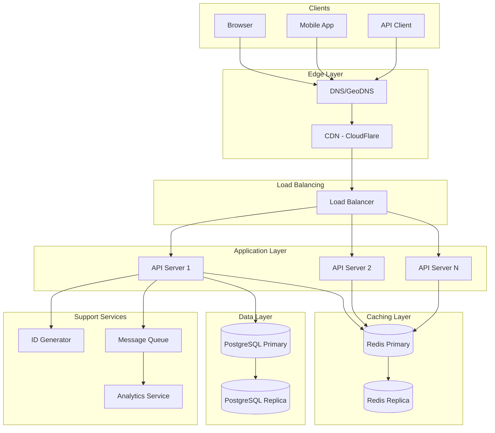
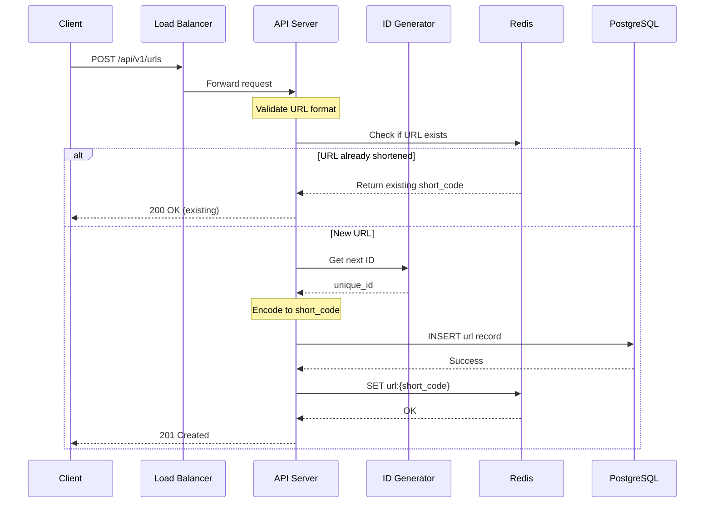
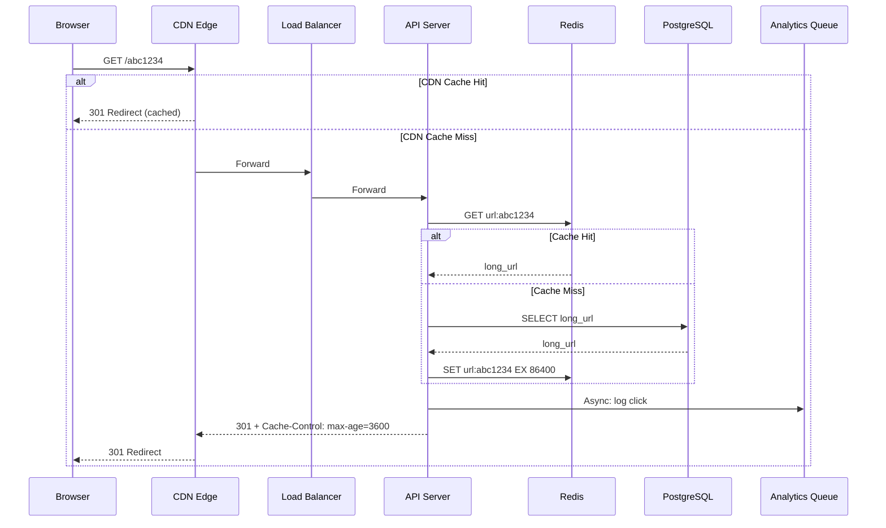
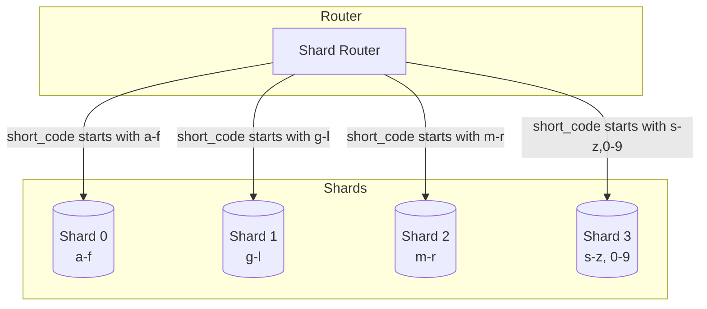
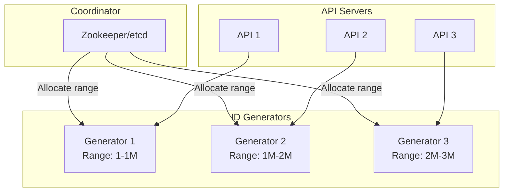
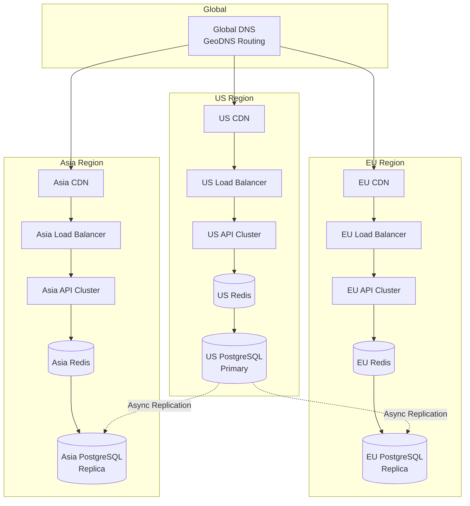
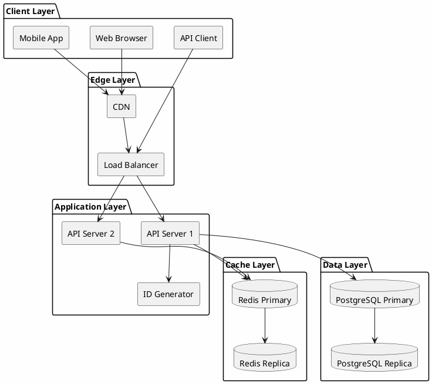

# URL Shortener - Architecture Diagrams

## High-Level Architecture



## Write Flow (Create Short URL)



## Read Flow (Redirect)



## Database Sharding Strategy



## ID Generation Service



## Multi-Region Deployment



## Component Interaction Matrix

```
┌─────────────────┬─────────┬───────┬─────┬──────────┬───────────┐
│                 │ CDN     │ API   │Cache│ Database │ Analytics │
├─────────────────┼─────────┼───────┼─────┼──────────┼───────────┤
│ CDN             │    -    │ sync  │  -  │    -     │     -     │
│ API Server      │  cache  │   -   │sync │   sync   │   async   │
│ Cache (Redis)   │    -    │ data  │  -  │  backup  │     -     │
│ Database        │    -    │ data  │  -  │    -     │     -     │
│ Analytics       │    -    │   -   │  -  │    -     │     -     │
└─────────────────┴─────────┴───────┴─────┴──────────┴───────────┘

Legend:
- sync: synchronous communication
- async: asynchronous communication
- cache: caching relationship
- data: data storage relationship
- backup: cache-aside pattern
```

---

## PlantUML Version (Alternative)

For more detailed diagrams, see `architecture.puml` file.


