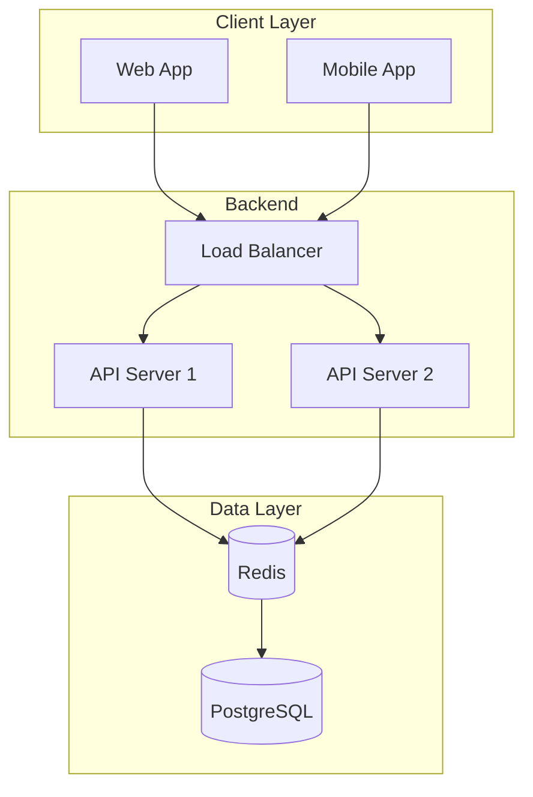
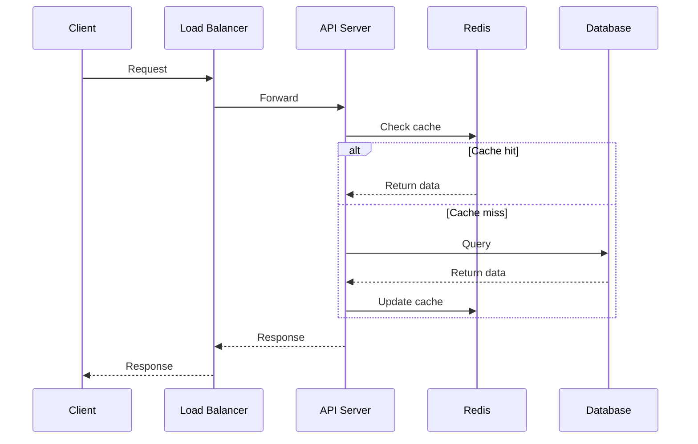
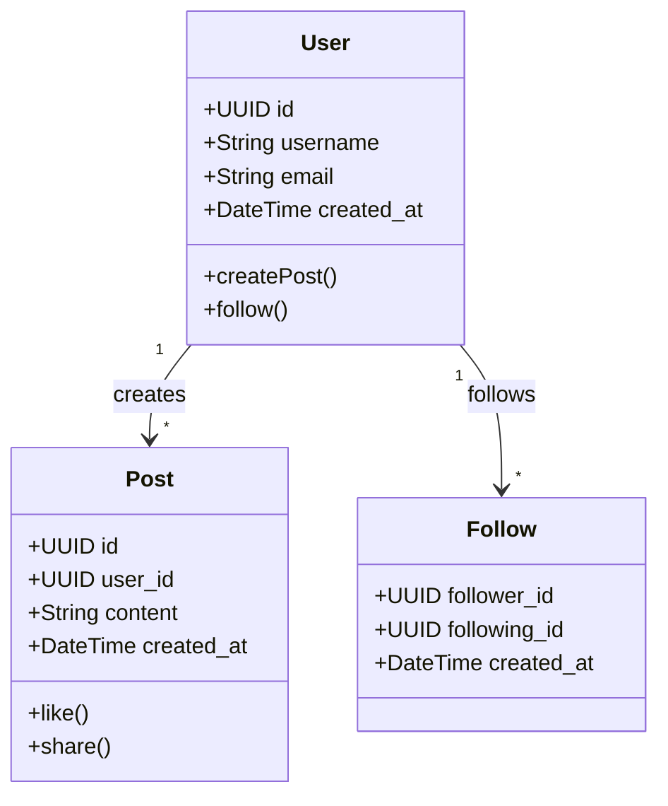
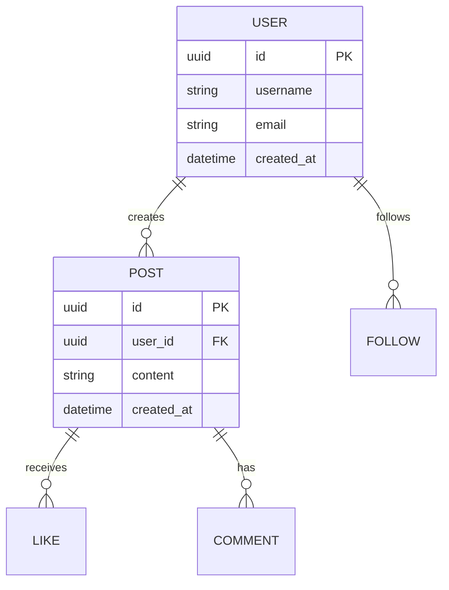
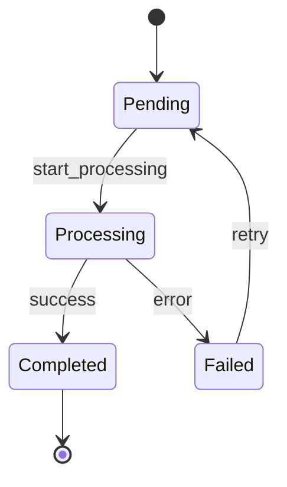
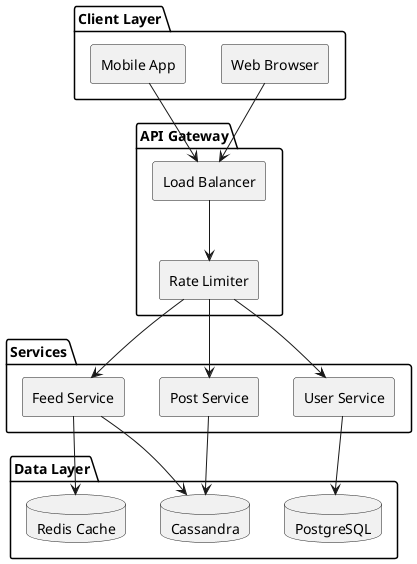
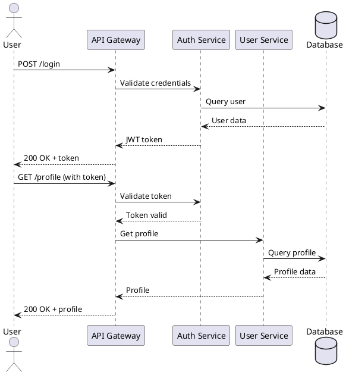

# Diagram Tools Integration Guide

This repository supports multiple diagram tools for creating system design visualizations.

---

## Supported Tools

| Tool | Type | Cost | Best For |
|------|------|------|----------|
| **Mermaid** | Text-to-diagram | Free | GitHub-native, quick diagrams |
| **PlantUML** | Text-to-diagram | Free | UML, sequence diagrams |
| **Miro** | Whiteboard | Free tier | Collaborative sessions |
| **Excalidraw** | Whiteboard | Free | Hand-drawn style |
| **D2** | Text-to-diagram | Free | Software architecture |
| **tldraw** | Whiteboard | Free | Open-source alternative |

---

## Mermaid Integration

### Native GitHub Support
Mermaid diagrams render directly in GitHub markdown.

### Syntax Examples

#### Flowchart


#### Sequence Diagram


#### Class Diagram (Data Model)


#### Entity Relationship


#### State Diagram


### Mermaid Resources
- [Official Documentation](https://mermaid.js.org/)
- [Live Editor](https://mermaid.live/)
- [GitHub Docs](https://docs.github.com/en/get-started/writing-on-github/working-with-advanced-formatting/creating-diagrams)

---

## PlantUML Integration

### Setup Options

1. **VS Code Extension:** PlantUML extension
2. **Online:** [PlantUML Server](https://www.plantuml.com/plantuml)
3. **GitHub Action:** Auto-generate PNGs on push

### GitHub Action Setup

Create `.github/workflows/plantuml.yml`:
```yaml
name: Generate PlantUML Diagrams

on:
  push:
    paths:
      - '**/*.puml'

jobs:
  generate:
    runs-on: ubuntu-latest
    steps:
      - uses: actions/checkout@v3

      - name: Generate diagrams
        uses: grassedge/generate-plantuml-action@v1.5
        with:
          path: design-problems
          message: "Generated PlantUML diagrams"
        env:
          GITHUB_TOKEN: ${{ secrets.GITHUB_TOKEN }}
```

### Syntax Examples

#### Architecture Diagram


#### Sequence Diagram


### PlantUML Resources
- [Official Documentation](https://plantuml.com/)
- [Real-World Examples](https://real-world-plantuml.com/)

---

## Miro Integration

### Embedding Miro Boards

#### Option 1: Link to Board
```markdown
**Interactive Whiteboard:** [View on Miro](https://miro.com/app/board/YOUR_BOARD_ID)
```

#### Option 2: Export and Embed Images
1. Export board as PNG/SVG from Miro
2. Add to `diagrams/` folder
3. Reference in markdown:
```markdown

```

#### Option 3: Miro Live Embed (for wikis/docs)
```html
<iframe
  width="768"
  height="432"
  src="https://miro.com/app/live-embed/YOUR_BOARD_ID/?moveToWidget=WIDGET_ID"
  frameBorder="0"
  scrolling="no"
  allow="fullscreen; clipboard-read; clipboard-write"
  allowfullscreen>
</iframe>
```

### Miro Templates for System Design

Create reusable templates with:
- Component shapes (servers, databases, queues)
- Connector styles (sync, async, data flow)
- Color coding (client, backend, data layer)
- Annotation boxes for trade-offs

### Miro Best Practices

1. **Organize with Frames:** Group related components
2. **Use Consistent Colors:**
   - Blue: Client components
   - Green: Backend services
   - Orange: Data stores
   - Purple: External services
3. **Add Annotations:** Explain key decisions
4. **Version Your Boards:** Duplicate before major changes

### Miro Resources
- [Miro Templates](https://miro.com/templates/)
- [Architecture Diagramming Guide](https://miro.com/guides/diagrams/software-architecture)

---

## Excalidraw Integration

### Why Excalidraw?
- Free and open-source
- Hand-drawn aesthetic
- JSON-based (version control friendly)
- VS Code extension available

### Setup

1. **VS Code Extension:** "Excalidraw" by pomdtr
2. **Online:** [excalidraw.com](https://excalidraw.com/)
3. **Save as:** `.excalidraw` files (JSON)

### Usage in Repository

```
diagrams/
├── architecture.excalidraw    # Editable source
├── architecture.png           # Exported for README
└── architecture.svg           # Exported for docs
```

### Excalidraw Libraries

Create component libraries for reuse:
- Database shapes
- Server icons
- Queue representations
- Load balancer symbols

---

## D2 (Declarative Diagramming)

### What is D2?
Text-to-diagram language designed for software architecture.

### Installation
```bash
# macOS
brew install d2

# Windows
choco install d2

# Or use online playground
# https://play.d2lang.com/
```

### Syntax Example

```d2
# d2/architecture.d2

direction: right

client: Client {
  shape: person
}

lb: Load Balancer {
  shape: hexagon
}

services: Services {
  api1: API Server 1
  api2: API Server 2
}

data: Data Layer {
  cache: Redis {
    shape: cylinder
  }
  db: PostgreSQL {
    shape: cylinder
  }
}

client -> lb -> services
services.api1 -> data.cache
services.api2 -> data.cache
data.cache -> data.db
```

### Generate Images
```bash
d2 architecture.d2 architecture.svg
d2 architecture.d2 architecture.png
```

---

## Diagram Conventions

### Color Coding Standard

| Color | Meaning |
|-------|---------|
| Blue (#4A90D9) | Client/Frontend |
| Green (#7ED321) | Backend Services |
| Orange (#F5A623) | Data Stores |
| Purple (#9013FE) | External/Third-party |
| Red (#D0021B) | Critical Path/Bottleneck |
| Gray (#9B9B9B) | Infrastructure |

### Line Styles

| Style | Meaning |
|-------|---------|
| Solid → | Synchronous call |
| Dashed --> | Asynchronous call |
| Dotted ··> | Optional/conditional |
| Bold ==> | Data flow |

### Labeling Best Practices

1. Label all connections with action/protocol
2. Include data format (JSON, Protobuf)
3. Note latency expectations
4. Mark critical paths

---

## Recommended Workflow

### For Quick Diagrams (README, discussions)
Use **Mermaid** - renders directly in GitHub

### For Detailed Architecture
Use **PlantUML** or **D2** - more control, better for complex diagrams

### For Collaborative Sessions
Use **Miro** or **Excalidraw** - real-time collaboration

### For Presentations
Export from any tool as PNG/SVG

---

## Resources

- [Mermaid Live Editor](https://mermaid.live/)
- [PlantUML Server](https://www.plantuml.com/plantuml)
- [Excalidraw](https://excalidraw.com/)
- [D2 Playground](https://play.d2lang.com/)
- [Miro](https://miro.com/)
- [tldraw](https://www.tldraw.com/)

---

*Choose the right tool for the job and maintain consistency within each design document.*
