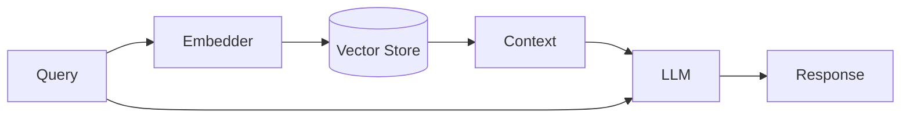

# AI/ML Infrastructure

## Overview

Machine learning systems have unique infrastructure requirements. This section covers patterns for building production ML systems.

---

## ML System Components

```
┌─────────────────────────────────────────────────────────────────┐
│                    ML System Architecture                        │
│                                                                  │
│  ┌─────────────┐   ┌─────────────┐   ┌─────────────┐           │
│  │   Data      │──►│  Training   │──►│   Model     │           │
│  │  Pipeline   │   │  Pipeline   │   │  Registry   │           │
│  └─────────────┘   └─────────────┘   └──────┬──────┘           │
│                                              │                   │
│                                              ▼                   │
│  ┌─────────────┐   ┌─────────────┐   ┌─────────────┐           │
│  │ Monitoring  │◄──│   Serving   │◄──│  Deployment │           │
│  │  & Logging  │   │  Infrastructure│  │  Pipeline  │           │
│  └─────────────┘   └─────────────┘   └─────────────┘           │
└─────────────────────────────────────────────────────────────────┘
```

---

## Key Concepts

### Feature Store
Centralized repository for ML features.

```
┌─────────────────────────────────────────────────────────────┐
│                      Feature Store                           │
│                                                              │
│  ┌───────────────┐    ┌───────────────┐                     │
│  │ Offline Store │    │ Online Store  │                     │
│  │  (Training)   │    │  (Inference)  │                     │
│  │               │    │               │                     │
│  │ • Historical  │    │ • Low latency │                     │
│  │ • Batch       │    │ • Real-time   │                     │
│  │ • Large scale │    │ • Point lookup│                     │
│  └───────────────┘    └───────────────┘                     │
│                                                              │
│  Examples: Feast, Tecton, Hopsworks                         │
└─────────────────────────────────────────────────────────────┘
```

### Model Serving Patterns

| Pattern | Latency | Throughput | Use Case |
|---------|---------|------------|----------|
| Online (REST/gRPC) | Low | Medium | Real-time predictions |
| Batch | High | High | Bulk scoring |
| Streaming | Low | High | Event-driven |
| Edge | Very Low | Varies | IoT, mobile |

### Vector Databases
Specialized databases for embedding storage and similarity search.

```
Popular Vector DBs:
├── Pinecone (Managed)
├── Milvus (Open source)
├── Weaviate (Open source)
├── Qdrant (Open source)
├── Chroma (Lightweight)
└── pgvector (PostgreSQL extension)

Use cases:
• Semantic search
• Recommendation systems
• RAG (Retrieval Augmented Generation)
• Image similarity
```

---

## LLM Integration Patterns

### RAG Architecture



### LLM Serving Considerations
- Token throughput
- Batching strategies
- KV cache management
- Model parallelism
- Quantization trade-offs

---

## MLOps Practices

### CI/CD for ML

```
Code Change
    │
    ▼
┌─────────────┐
│   Tests     │── Unit, Integration
└──────┬──────┘
       │
       ▼
┌─────────────┐
│  Training   │── Retrain with new code
└──────┬──────┘
       │
       ▼
┌─────────────┐
│ Validation  │── Model quality checks
└──────┬──────┘
       │
       ▼
┌─────────────┐
│  Registry   │── Version and store
└──────┬──────┘
       │
       ▼
┌─────────────┐
│   Deploy    │── Canary/Blue-green
└─────────────┘
```

### Model Monitoring
- Prediction drift
- Feature drift
- Data quality
- Latency/throughput
- Business metrics

---

## Technologies

| Category | Tools |
|----------|-------|
| Training | PyTorch, TensorFlow, JAX |
| Serving | TensorFlow Serving, Triton, TorchServe |
| Orchestration | Kubeflow, MLflow, Airflow |
| Feature Store | Feast, Tecton |
| Experiment Tracking | MLflow, Weights & Biases, Neptune |
| Vector DB | Pinecone, Milvus, Weaviate |

---

## Deep Dives (In this folder)
- `feature-stores.md` - Design and implementation
- `model-serving.md` - Serving patterns at scale
- `vector-databases.md` - Embedding storage
- `llm-infrastructure.md` - Large language model systems
- `mlops.md` - ML operations practices

---

## Resources
- [Machine Learning Systems Design](https://stanford-cs329s.github.io/)
- [Designing Machine Learning Systems (Book)](https://www.oreilly.com/library/view/designing-machine-learning/9781098107956/)
- [MLOps Community](https://mlops.community/)
