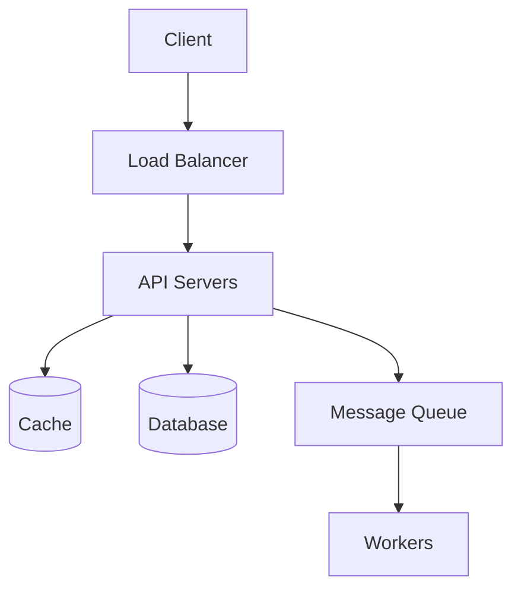

# [System Name] - System Design

> **Difficulty:** [Beginner | Intermediate | Advanced | Expert]
> **Time:** 45-60 minutes
> **Companies:** [List companies that ask this]

---

## Problem Statement

Design [System Name] that allows users to [core functionality].

**Real-world examples:** [Examples like Twitter, WhatsApp, etc.]

---

## Step 1: Clarify Requirements

### Functional Requirements

| Requirement | Priority | Notes |
|-------------|----------|-------|
| [Feature 1] | Must Have | [Details] |
| [Feature 2] | Must Have | [Details] |
| [Feature 3] | Nice to Have | [Details] |

### Non-Functional Requirements

| Requirement | Target | Notes |
|-------------|--------|-------|
| Availability | 99.99% | [Calculation or justification] |
| Latency | p99 < 200ms | [For which operations] |
| Consistency | [Strong/Eventual] | [Justification] |
| Durability | No data loss | [For which data] |

### Out of Scope
- [Feature X] - Not required for this design
- [Feature Y] - Can be discussed as extension

### Assumptions
- [Assumption 1]
- [Assumption 2]

---

## Step 2: Capacity Estimation

### Traffic Estimates

| Metric | Calculation | Result |
|--------|-------------|--------|
| Daily Active Users | Given | [X]M |
| [Operation] per day | [DAU] × [frequency] | [Y]M |
| [Operation] per second | [per day] / 86400 | [Z] TPS |
| Peak TPS | [TPS] × 3 | [A] TPS |

### Storage Estimates

| Data Type | Size | Volume | Total |
|-----------|------|--------|-------|
| [Data 1] | [X] bytes | [Y]/day | [Z] GB/day |
| [Data 2] | [X] KB | [Y]/day | [Z] GB/day |
| **5-year total** | | | **[T] TB** |

### Bandwidth Estimates

| Direction | Calculation | Result |
|-----------|-------------|--------|
| Incoming | [TPS] × [size] | [X] MB/s |
| Outgoing | [TPS] × [size] | [Y] MB/s |

### Summary
```
Read:Write Ratio = [X]:1
Peak QPS = [Y]
Storage (5 years) = [Z] TB
```

---

## Step 3: API Design

### Core APIs

#### [API 1 Name]
```
POST /api/v1/[endpoint]

Request:
{
    "field1": "value",
    "field2": "value"
}

Response: 201 Created
{
    "id": "generated_id",
    "created_at": "timestamp"
}
```

#### [API 2 Name]
```
GET /api/v1/[endpoint]/{id}

Response: 200 OK
{
    "field1": "value",
    "field2": "value"
}
```

### API Considerations
- [ ] Authentication mechanism
- [ ] Rate limiting strategy
- [ ] Pagination approach
- [ ] Error response format

---

## Step 4: High-Level Design

### Architecture Diagram



### Components

| Component | Responsibility | Technology Options |
|-----------|----------------|-------------------|
| Load Balancer | Distribute traffic | Nginx, AWS ALB |
| API Servers | Handle requests | Node.js, Go, Java |
| Cache | Reduce DB load | Redis, Memcached |
| Database | Persistent storage | PostgreSQL, Cassandra |
| Queue | Async processing | Kafka, RabbitMQ |

---

## Step 5: Data Model

### Database Schema

```sql
-- Table 1
CREATE TABLE [table_name] (
    id UUID PRIMARY KEY,
    field1 VARCHAR(255) NOT NULL,
    field2 TIMESTAMP DEFAULT NOW(),
    created_at TIMESTAMP DEFAULT NOW()
);

-- Indexes
CREATE INDEX idx_[field] ON [table]([field]);
```

### Data Flow

```
Write Path:
1. Client sends request
2. API validates input
3. Write to database
4. Update cache
5. Return response

Read Path:
1. Client sends request
2. Check cache
3. If miss, query database
4. Update cache
5. Return response
```

---

## Step 6: Deep Dive

### [Component 1] Deep Dive

**Challenge:** [Describe the challenge]

**Approach Options:**

| Approach | Pros | Cons |
|----------|------|------|
| [Option A] | [Pro 1], [Pro 2] | [Con 1], [Con 2] |
| [Option B] | [Pro 1], [Pro 2] | [Con 1], [Con 2] |

**Chosen Approach:** [Option X]

**Rationale:** [Why this approach fits our requirements]

### [Component 2] Deep Dive

[Similar structure]

---

## Step 7: Scaling & Bottlenecks

### Identified Bottlenecks

| Bottleneck | Impact | Solution |
|------------|--------|----------|
| [Bottleneck 1] | [Impact] | [Solution] |
| [Bottleneck 2] | [Impact] | [Solution] |

### Scaling Strategies

```
Current: Single region, N servers
Step 1: Add read replicas → handle [X] more reads
Step 2: Add caching layer → reduce DB load by [Y]%
Step 3: Shard database → handle [Z] more writes
Step 4: Multi-region → reduce latency for global users
```

---

## CAP Theorem Analysis

**Our choice:** [CP / AP]

**Justification:**
- [Reason 1]
- [Reason 2]

**Trade-offs accepted:**
- [Trade-off 1]
- [Trade-off 2]

---

## Design Principles Applied

| Principle | How Applied |
|-----------|-------------|
| Stateless Services | [Description] |
| Idempotency | [Description] |
| Caching | [Description] |
| Async Processing | [Description] |

---

## Monitoring & Alerting

### Key Metrics

| Metric | Threshold | Action |
|--------|-----------|--------|
| Error rate | > 1% | Page on-call |
| Latency p99 | > 500ms | Alert team |
| Queue depth | > 10000 | Scale workers |

---

## Follow-up Questions

Common interviewer follow-ups:
1. How would you handle [edge case]?
2. What if [requirement] changes to [new requirement]?
3. How would you migrate from [old] to [new]?

---

## References

- [Link 1]
- [Link 2]
- [Link 3]

---

*Last updated: YYYY-MM-DD by @contributor*
